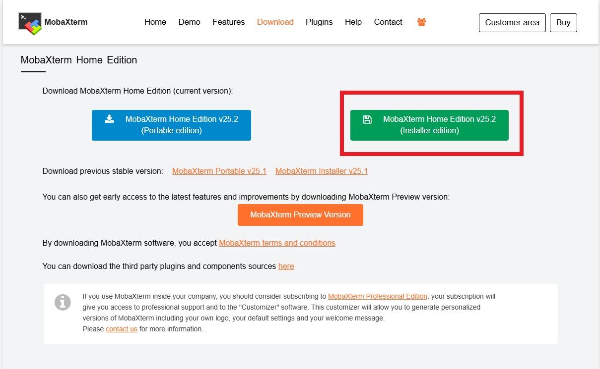
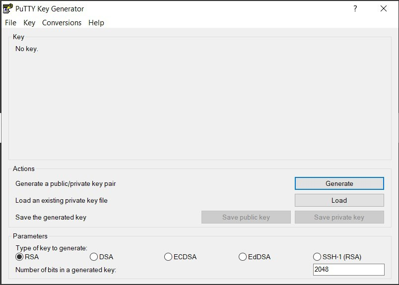
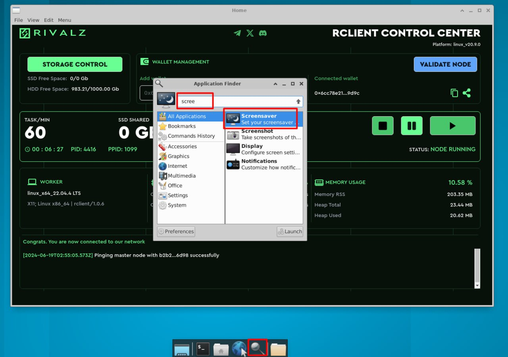
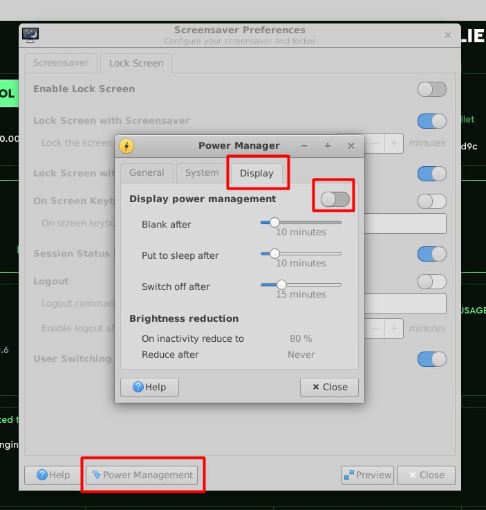
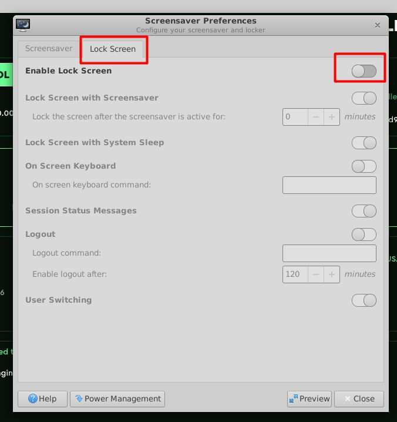
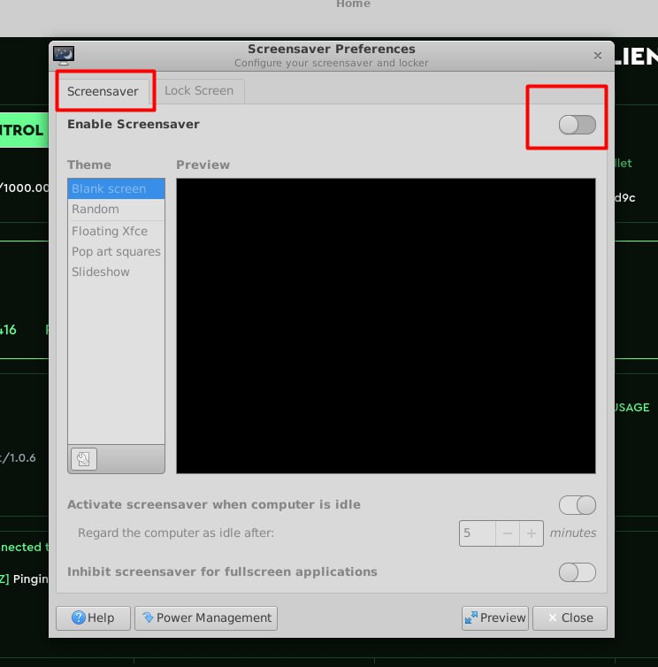

# Virtual Private Server
Want to run your own bots, websites, or even crypto nodes 24/7? A Virtual Private Server (VPS) is the game-changer you've been looking for!

Visit this [LINK](https://www.kqzyfj.com/click-101201397-17083153) to use my affiliate link

***Discounted rate is good for 1 year plan***


  ##  STEP BY STEP ON HOW TO MAKE A PURCHASE
  
1. Change currency to EURO for lower rate. 
2. Choose Cloud VPS 10 - VPS 60
3. For region, choose european union or as long as its FREE!
4. Choose SSD/NVMe storage type(FREE)
5. Choose Ubuntu 22.04
6. Leave the rest as default
7. Click next > Fillup the form
8. Choose your payment method
9. Check email for the cpanel login
10. Login to your cpanel together with system generated password
11. Change your password and activate 2FA authentication with google authy app.
12. Wait for another email that includes the IP address of your VPS

  ## DOWNLOAD AND ACCESS THRU TERMINAL

1. Go to: https://mobaxterm.mobatek.net/download-home-edition.html
2. Choose installer edition
3. Install and open
4. Click session then SSH
5. Enter your IP address to remote host
6. Tick the specify username and type root
7. Click OK button
8. Enter your password

  ## SECURE YOUR VPS WITH SSH KEY

1. Copy and paste to run this command
```bash
mkdir -p ~/.ssh
chmod 700 ~/.ssh
nano ~/.ssh/authorized_keys
```
2. Go to: https://filehippo.com/download_puttygen/
3. Download, install and open it
4. Click generate
5. Move your mouse until you complete the progress bar
6. Save your private key to a secured location
7. You will see Public key for pasting into OpenSSH
8. Right click inside the box
9. Select all and copy
10. Go back to your terminal and paste it
11. Control X Y then enter to save the file
12. Close the tab
13. Right click to your VPS to edit the session
14. Tick the checkbox 'Specify username'
15. Type root
16. Go to advanced SSH settings
17. Tick the checkbox 'Use private key'
18. Click the icon to open and locate your private key
19. Click OK then login now

*This will automatically login to your VPS (no need to type root and password) but do not close your terminal yet proceed to next step 👇

  ## INSTALL RDP (Remote Desktop Protocol)

Run this command
```bash
nano rdp.sh
```

copy paste this
```bash
#!/bin/bash

# Check if the script is being run with root privileges
if [ "$EUID" -ne 0 ]; then
echo "Please run as root."
exit 1
fi

# Check for required parameters
if [ $# -ne 2 ]; then
echo "Usage: $0 <username> <password>"
exit 1
fi

# Define user and password variables from script parameters
NEW_USER=$1
NEW_PASSWORD=$2

# Update the package list and upgrade all your packages to their latest versions.
echo "Updating package list and upgrading packages..."
apt update && apt upgrade -y

# Install all necessary packages
echo "Installing necessary packages..."
apt install -y xfce4 xfce4-goodies xrdp net-tools wget ethtool flatpak

# User Creation
# Add the user with the specified username and password
echo "Creating new user..."
useradd -m -s /bin/bash $NEW_USER
echo "$NEW_USER:$NEW_PASSWORD" | chpasswd
# Add the user to the sudo group for administrative rights
usermod -aG sudo $NEW_USER

# XRDP Configuration
# Configure xrdp to use XFCE desktop
echo "startxfce4" > /home/$NEW_USER/.xsession
chown $NEW_USER:$NEW_USER /home/$NEW_USER/.xsession

# Restart xrdp service to apply new port
echo "Configuring xrdp..."
systemctl restart xrdp
# Enable xrdp at startup
systemctl enable xrdp

# Firefox with flatpak
flatpak remote-add --if-not-exists flathub https://flathub.org/repo/flathub.flatpakrepo
flatpak install -y flathub org.mozilla.firefox
# Set as default browser
update-alternatives --install /usr/bin/x-www-browser x-www-browser /var/lib/flatpak/exports/bin/org.mozilla.firefox 200 && sudo update-alternatives --set x-www-browser /var/lib/flatpak/exports/bin/org.mozilla.firefox

# Create the systemd service file for network configuration
echo "Creating systemd service for network configuration..."
sudo tee /etc/systemd/system/eth0-config.service > /dev/null <<EOL
[Unit]
Description=Configure eth0 network interface
After=network.target

[Service]
Type=oneshot
ExecStart=/usr/sbin/ethtool -s eth0 speed 1000 duplex full autoneg off
RemainAfterExit=yes

[Install]
WantedBy=multi-user.target
EOL

# Reload systemd to recognize the new service
sudo systemctl daemon-reload
# Enable the service to start on boot
sudo systemctl enable eth0-config.service
# Start the service immediately
sudo systemctl start eth0-config.service

# Clear command history
history -w
history -c

# Print the message important note
echo -e "
#################################################\n\
# Installation completed.
#################################################\n\
Components installed and started:\n\
- XFCE Desktop\n\
- xrdp\n\
- Firefox\n\
- Network configuration service\n\
"
```
Control ``X Y`` then ``Enter`` to save
```bash
sudo chmod +x rdp.sh
```

Replace your desired username and password
```bash
sudo ./rdp.sh username password
```

  ## INSTALL GOOGLE CHROME
```bash
sudo apt update
```
```bash
wget https://dl.google.com/linux/direct/google-chrome-stable_current_amd64.deb
```
```bash
sudo apt install ./google-chrome-stable_current_amd64.deb
```

***If error occured then run this command, after that run the last command 👆***
```bash
sudo apt-get install -f
```

  ## CONNECT TO YOUR VPS THRU RDP

1. On your PC, search remote desktop connection
2. Click to open
3. On computer, enter the IP address
4. Enter your username then your password

  ## HOW TO TURN OFF SCREENSAVER
***This will prevent the machine from going into a low-power state or locking the screen which the node extensions or other nodes will operate without interruption so you must disable the lock screen, screensaver and power management.***





If you encountered any issues join and send message to our [telegram](https://t.me/airdropPH2024room)
