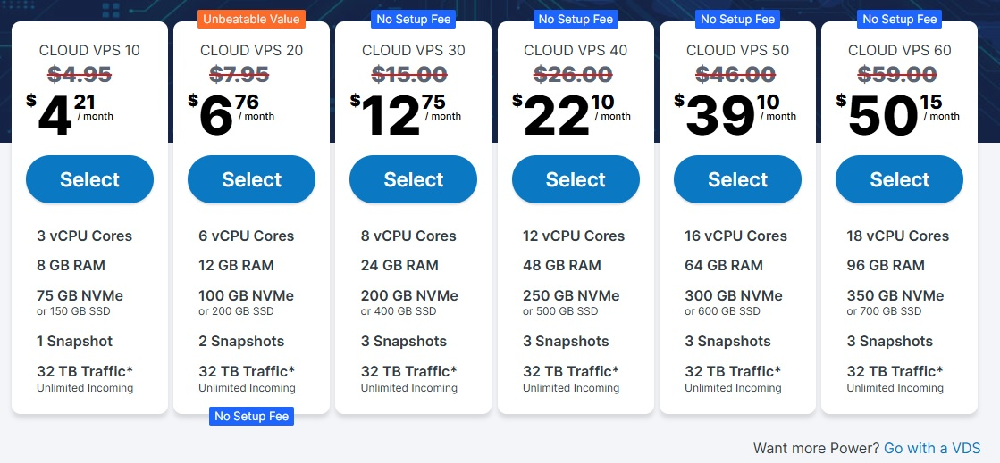
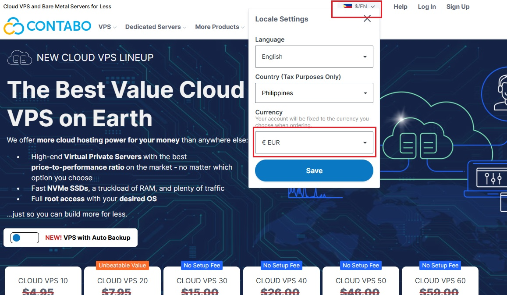

# Virtual Private Server
Want to run your own bots, websites, or even crypto nodes 24/7? A Virtual Private Server (VPS) is the game-changer you've been looking for!

Visit this [LINK](https://www.kqzyfj.com/click-101201397-17083153) to use my affiliate link

***Discounted rate is good for 1 year plan***

  ##  STEP BY STEP ON HOW TO MAKE A PURCHASE
1. Change currency to EURO for lower rate. 
2. Choose Cloud VPS 10 - VPS 60
3. For region, choose european union or as long as its FREE!
4. Choose SSD/NVMe storage type(FREE)
5. Choose Ubuntu 22.04
6. Leave the rest as default
7. Click next > Fillup the form
8. Choose your payment method
9. Check email for the cpanel login
10. Login to your cpanel together with system generated password
11. Change your password and activate 2FA authentication with google authy app.
12. Wait for another email that includes the IP address of your VPS
